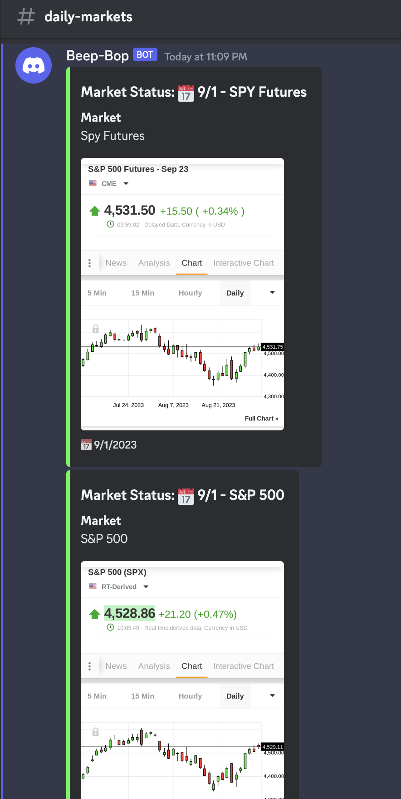

# Market Status Automation

## Contents

- [Market Status Automation](#market-status-automation)
  - [Purpose](#purpose)
  - [Getting Started](#getting-started)
    - [Prerequisites](#prerequisites)
    - [Clone Repository](#clone-repository)
    - [Install Dependencies From Project Root](#install-dependencies-from-project-root)
  - [Setup: Web Automation (Capturing Market Instruments)](#setup--web-automation--capturing-market-instruments-)
    - [Run Playwright to perform screenshot automation](#run-playwright-to-perform-screenshot-automation)
  - [Setup: Discord Webhook](#setup--discord-webhook)
    - [Create Discord Webhook](#create-discord-webhook)
    - [Export the Webhook to an env variable](#export-the-webhook-to-an-env-variable)
    - [Invoke a POST request to your webhook](#invoke-a-post-request-to-your-webhook)
  - [Connecting with CI CD (optional)](#connecting-with-ci-cd--optional-)
  - [Tech Stack](#tech-stack)
  - [Notable Files](#notable-files)
    - [playwright-report (Directory)](#playwright-report--directory-)
    - [playwright.config.ts](#playwrightconfigts)
    - [readme.md](#readmemd)
    - [src (Directory)](#src--directory-)
    - [tests (Directory)](#tests--directory-)
  - [Motivation](#motivation)
  - [References:](#references-)

<small><i><a href='http://ecotrust-canada.github.io/markdown-toc/'>Table of contents generated with markdown-toc</a></i></small>

## Purpose

This tool allows you to

1. Create screenshots created from Playwright automation scripts that emulate an iPhone 13 environment on Safari.

2. Send the screenshots over to a Discord webhook of your choice.

The resulting output may look something similar to below



## Getting Started

### Prerequisites

- node16 or higher

### Clone Repository

```bash
git clone git@github.com:MSoup/discord-market-publish.git
```

### Install Dependencies From Project Root

```bash
npm ci
```

## Setup: Web Automation (Capturing Market Instruments)

### Run Playwright to perform screenshot automation

```bash
npx playwright test
```

This should populate three screenshot files in your project root, like:

```bash
.
...
├── us-spx-500-futures.png
├── us-spx-500.png
└── usd-jpy.png
```

You can also run `npx playwright show-report` to see a detailed report of what was run.


## Setup: Discord Webhook

### Create Discord Webhook

Follow the instructions [here](https://support.discord.com/hc/en-us/articles/228383668-Intro-to-Webhooks) up to the point where you copy the webhook url. It should be in the form of `https://discord.com/api/webhooks/{someLongHash}`

### Export the Webhook to an env variable

\*Make sure you replace the webhook URL with the actual one for your Discord channel. The `.env` file should be in your project root.

```bash
touch .env && echo WEBHOOK_URL="https://discord.com/api/webhooks/{someLongHash}"
```

### Invoke a POST request to your webhook

```bash
npm run invoke-webhook MARKET_SYMBOL
```

NOTE: `MARKET_SYMBOL` as of 9/5/2023 is one of: `'usd-jpy' | 'spy' | 'spy-futures'` as defined in `types.d.ts` here:

```typescript
type MarketSymbol = 'usd-jpy' | 'spy' | 'spy-futures';
```

`"invoke-webhook"` resolves to "npx ts-node src/app.ts"

If successful, your console should log `"Webhook delivered successfully"`.

## Connecting with CI CD (optional)

The purpose of connecting this repo to a CICD flow is to take advantage of the `schedule` feature of Github Actions (or whatever you choose). In `.github/workflows` you will see a `screenshot_and_invoke_webhook.yml` file.

Adjust the `schedule` block to have this workflow run as you please.

```yml
schedule:
  - cron: '30 8 * * 1,5'
  - cron: '0 13 * * 1,5'
  - cron: '45 13 * * 1,5'
  - cron: '0 21 * * 1,5'
```

Notes:

- \* is a special character in YAML so you have to quote these strings
- The time is in UTC
- An example of `schedule` usage is here

This example triggers the workflow to run at 5:30 UTC every Monday-Thursday, but skips the Not on Monday or Wednesday step on Monday and Wednesday.

```yml
on:
  schedule:
    - cron: '30 5 * * 1,3'
    - cron: '30 5 * * 2,4'

jobs:
  test_schedule:
    runs-on: ubuntu-latest
    steps:
      - name: Not on Monday or Wednesday
        if: github.event.schedule != '30 5 * * 1,3'
        run: echo "This step will be skipped on Monday and Wednesday"
      - name: Every time
        run: echo "This step will always run"
```

## Tech Stack

| Category           | Tech              | Version |
| ------------------ | ----------------- | ------- |
| Backend            | NodeJS            | 16.17.1 |
| Backend Language   | TypeScript        | 5.2.2   |
| Web Automation     | Playwright        | 1.37.1  |
| Webhook Invocation | axios             | 1.5.0   |
| Webhook Invocation | axios             | 1.5.0   |
| Linter             | typescript-eslint | 6.5.0   |
| Code Formatter     | Prettier          | 1.5.0   |
| Unit Tests         | NA                | NA      |
| CI-CD              | Github Actions    | NA      |
| Database           | NA                | NA      |

## Notable Files

### playwright-report (Directory)

Store generated reports or logs related to Playwright test execution as a result of running `npx playwright show-report`

### playwright.config.ts

This TypeScript configuration file is used to define various settings and options for configuring Playwright's behavior during test execution. It includes settings such as browser type, test environment, test timeouts, and more.

Please note that this project has only been configured to work with mobile screen sizes that fit an iPhone 12/13/14.

### readme.md

You're reading it.

### src (Directory)

Contains the entrypoint for the webhook invocation at `app.ts`. Also contains helper functions to be consumed by `app.ts` and the Playwright test suite.

### tests (Directory)

Holds the actual test scripts written using Playwright's API. These scripts are responsible for emulating a browser environment on the device defined in `playwright.config.ts` in order to capture screenshots.

## Motivation

This project was inspired by a daily interaction between friends of mine. For years, we took the time to screenshot the state of the market and share them with each other.

Eventually, I stumbled upon the idea of Discord webhooks, and was able to invoke it with this tiny curl command snippet

```bash
# A script to send an image over to discord
% curl -H 'Content-Type: multipart/form-data' \
   -F 'payload_json={"username": "Beep-Bop", "content": "hello"}' \
   -F "file1=@usd-jpy.png" \
   $WEBHOOK_URL
```

But I was not satisfied with the lack of flexibility of this curl command. This spawned the project you see here.

## References

- https://discord.com/developers/docs/resources/webhook
- https://discord.com/safety/using-webhooks-and-embeds
- https://playwright.dev/
- https://playwright.dev/docs/api/class-playwright
